# RAG chatbot architecture

Retrieval-Augmented Generation (RAG) grounds an LLM on **your** documents so answers cite private or fresh knowledge instead of relying only on model weights.

---

## High-level flow

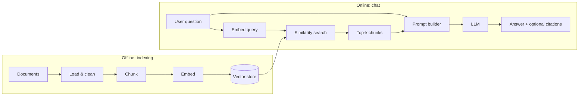

---

## Core components

| Layer | Role | Typical choices |
|--------|------|------------------|
| **Ingestion** | Scrape allowlisted HTTP; optional official REST; **separate** broker REST APIs for non-corpus data (optional) | Connectors → normalize → segment; see **Detailed ingestion architecture** |
| **Chunking** | Split text into retrievable units | Fixed size, sentence-aware, heading-based, semantic chunking |
| **Embedding** | Map chunk and query text to vectors | Local models (e.g. MiniLM, BGE), or hosted APIs |
| **Vector store** | Persist vectors + metadata; similarity search | Chroma, Qdrant, pgvector, OpenSearch, Pinecone — see **RAG pipeline and vector database storage** |
| **Retriever** | Turn question → candidate passages | Top-k dense; optional hybrid (BM25 + dense), reranker |
| **Generator** | Produce natural language using retrieved context | Chat LLM with strict “answer from context” system prompt |
| **Orchestration** | Wire steps, logging, retries, guardrails | LangGraph, custom service, or thin API layer |

---

## Data model (conceptual)

Each stored unit is usually:

- **`text`**: chunk body used for retrieval and injected into the prompt  
- **`embedding`**: vector for similarity search  
- **`metadata`**: `source_id`, `uri`, `title`, `chunk_index`, `timestamp`, ACLs, etc.

Optional: store **parent document id** so you can expand a hit to neighboring chunks (“window retrieval”).

---

## RAG pipeline and vector database storage

This section ties **ingestion output** to **retrieval input**: what is persisted, where it lives, and how the **chat path** reads it—aligned with **`problem_Statement.md`** (official sources, one citation, chunk-grounded answers).

### Index-time vs query-time

| Phase | Responsibility | Writes / reads |
|-------|----------------|----------------|
| **Index-time** (cron or manual job) | Fetch or load documents → extract → chunk → **embed** → **upsert** | **Writes** vectors + metadata to the **vector DB**; updates **ingest manifest** / `ingest_runs` / `live_as_of` |
| **Query-time** (each chat turn) | Embed question → **ANN search** → pack context → LLM | **Read-only** on the vector DB (no chunk updates during chat) |

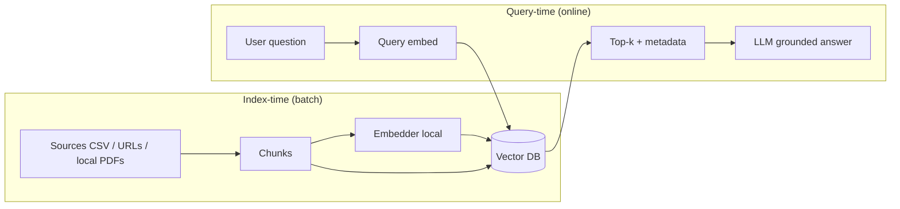

---

### Per-point storage (what each vector row contains)

Whether you use **Chroma**, **Qdrant**, **pgvector**, or another engine, each **point** (row) should support at minimum:

| Field | Stored as | Purpose |
|-------|-----------|---------|
| **`id`** | string (deterministic) | Stable `chunk_id` for upsert/delete and audits (`canonical_url` + `chunking_version` + `chunk_index` or hash). |
| **`vector`** | float32 array length `d` | Dense embedding; **L2-normalized** if using cosine. |
| **`document`** or **`text`** | string | Chunk text injected into the LLM context (often same as embed input body). |
| **`metadata`** | JSON / key-value | **`canonical_url`** (normalized), **`document_type`**, **`scheme`** (or `scheme_id`), **`chunk_index`**, **`fetched_at`**, **`content_hash`**, **`embedding_model_id`**, optional **`heading_path`**. |

**Do not** store secrets or PII in metadata. Keep **`canonical_url`** suitable for the **single user-facing citation** rule.

---

### `canonical_url` normalization (storage rule)

Download and browser URLs often carry tracking query strings (`?_gl=…`, `utm_*`, `_gcl_au`, etc.). For **deduplication**, **delete-by-source**, and **stable citations**:

1. Parse URL; **drop** known tracking query parameters before upsert.  
2. Store **normalized URL** in metadata as the primary `canonical_url`.  
3. Optionally store **`source_url_raw`** in ingest logs only (not required in vector metadata).

Same normalization in **ingest manifest** keys and **CSV** rows after import.

---

### Collection layout (recommended MVP)

- **One logical collection** (e.g. `mf_faq_corpus`) for all official chunks.  
- **Filter at query time** with metadata: e.g. `where scheme == "hdfc_elss"` only if the product exposes scheme selection; otherwise search the whole collection.  
- **Separate collection** (or exclude at ingest) for any content you do **not** want mixed with KIM/SID facts (e.g. marketing blog pages—see **`sources.csv`** note below).

---

### Backend options (operational)

| Engine | Persistence | Good for |
|--------|-------------|----------|
| **Chroma** | `PersistentClient(path=…)` | Fast local / small team; embedded metadata. |
| **Qdrant** | Server or cloud | Strong filters, payload indexes, production scale. |
| **pgvector** (Postgres) | Same DB as app | One stack for **vectors + `ingest_runs` + threads`**; SQL backups. |

Tune **HNSW / IVF** parameters per vendor docs; **cosine** distance on **unit** vectors is the default assumption in this architecture.

---

### Query path (vector DB read sequence)

1. **Embed** user query with the **same** local model as index time.  
2. **Query** the index: `top_k` + optional **metadata filter** (`scheme`, `document_type`).  
3. **Hydrate** hits: read `document` + metadata for each id.  
4. **Pack** into the prompt (token cap); **never** write back to the vector DB on this path.

---

### Curated catalog: `downloaded_sources/sources.csv`

This repo’s **authoritative allowlist + metadata** for HDFC-oriented sources is **`downloaded_sources/sources.csv`**, with columns:

- **`url`** — Official document or page URL (use as **`canonical_url`** after **normalization**).  
- **`document_type`** — e.g. `KIM`, `SID`, `Factsheet`, `Notice`, `Disclosure`, `Charter`, `FAQ`, `Web`, `Presentation`, `Report`. Maps to chunk metadata for filters and prompts.  
- **`scheme`** — e.g. `hdfc_large_cap`, `hdfc_flexi_cap`, `hdfc_elss`, `general`; use for **metadata filtering** and analytics.  
- **`description`** — Human-readable label for operators (not required for retrieval).

**Ingest job behavior**

1. **Parse CSV** → one **work unit** per row.  
2. For each **`url`**: `GET` the URL (or, if operating **offline**, match a file under **`downloaded_sources/`** whose content was produced from that URL and use file bytes—**same hash pipeline**).  
3. Attach **`document_type`** and **`scheme`** from the row onto **every chunk** derived from that document.  
4. **Incremental embed**: if normalized **`content_hash`** unchanged for that normalized `canonical_url`, skip re-embed.

**Compliance note (`problem_Statement.md`)**  
Rows must stay within **official AMC / AMFI / SEBI** style sources. A **bank blog** or other **non-fund-disclosure** page in the CSV should be **reviewed**: either **remove** from the FAQ corpus, **ingest to a separate collection** with different UI rules, or **exclude** from citation-eligible chunks—otherwise “facts-only from official documents” becomes ambiguous.

**JSON manifest (`sources_manifest*.json`)** remains an **optional** alternate if you prefer path-based local files without URLs in CSV; **`sources.csv`** is the **primary** curated list for this project layout.

The checked-in **`scraper.py`** module is described under **Reference implementation: `scraper.py` (`HDFCScraper`)** in the ingestion section—point it at this CSV (and fix **`file://`** PDF URLs to official **`https://`** metadata) before indexing to the **vector DB**.

#### Dual ingest: `downloaded_sources/` + Alpha Vantage (this repo)

The **`project/app/services/rag_pipeline.py`** orchestrator supports **both** tracks in one indexing pass:

| Track | Input | What gets embedded | Chroma `category` (typical) | Citation `url` in metadata |
|-------|--------|--------------------|-----------------------------|----------------------------|
| **Official corpus** | **`downloaded_sources/sources.csv`** (+ HTTP fetch of each **`url`**) | AMC / regulator HTML and PDF text | `Key Information Memorandum`, `Factsheet`, … | Normalized **official** document URL |
| **Alpha Vantage — documentation** | Repo file **`API Documentation \| Alpha Vantage.pdf`** | Full PDF text extract (API reference for “how to call AV”) | **`Alpha Vantage API Docs`** | **`https://www.alphavantage.co/documentation/`** (not `file://`) |
| **Alpha Vantage — market data** | Optional **`downloaded_sources/alpha_vantage_feeds.csv`** (`symbol`, `function`, …) **or** env **`ALPHA_VANTAGE_SYMBOLS`** | JSON responses turned into readable text | **`Market Data`** | Same **documentation** URL (third-party data; label answers clearly in UI) |

Call **`RAGPipeline.ingest_all()`** to run, in order: **`ingest_from_sources_csv`** → **`ingest_alpha_vantage_documentation_pdf`** → **`ingest_alpha_vantage_market_data`**. Respect the **~25 requests/day** free-tier budget: keep **`av_max_calls`** small, use **`time.sleep`** between calls, and treat market JSON as **supplemental** to AMC facts—not as replacement for KIM/SID **official** citations in `problem_Statement.md`.

---

## Detailed architecture: chunking and embeddings

Chunking and embeddings together define **what** is searchable and **how** similarity is measured. Mistakes here show up as missed facts, wrong passages, or contradictory context in the LLM prompt.

### Design goals

| Goal | Chunking lever | Embedding lever |
|------|----------------|-----------------|
| **High recall** (answer is somewhere in retrieved set) | Smaller chunks or sliding windows; neighbor expansion | Query-paraphrase robust models; hybrid keyword |
| **High precision** (top passages are on-topic) | Section-aware splits; dedup; rerank after retrieve | Quality embedding model; normalize vectors consistently |
| **Stable citations** | One **canonical URL** per chunk (or explicit primary URL) | N/A (metadata), but bad chunks break trust |
| **Reproducible reindex** | Versioned **chunking config** + deterministic IDs | Versioned **embedding model** + same preprocess |

---

### End-to-end pipeline (index time)

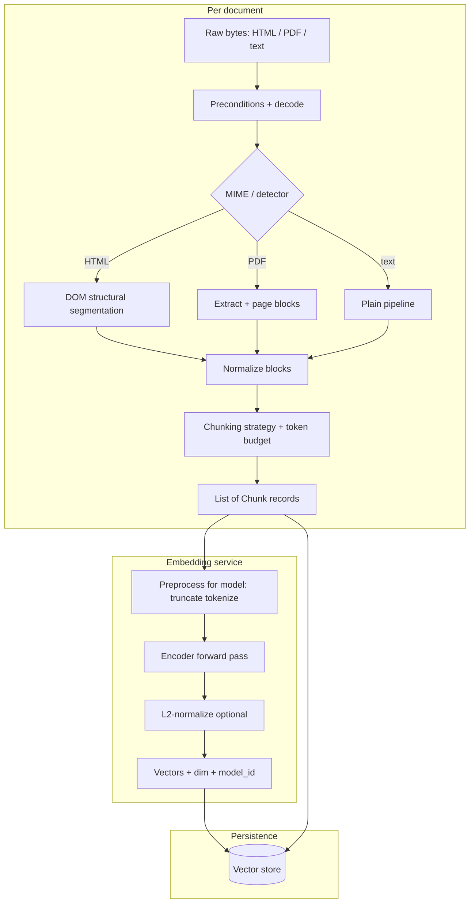

At **query time**, the user (or rewritten) question follows **only** the **embed** path’s **same** `PRE` + `ENC` + `VEC` rules, then nearest-neighbor search against `VS`.

---

### Preconditions (before structural segmentation)

These gates run **before** DOM or PDF logic so chunking stays **deterministic** across cron runs and safe for downstream **hashing** (`content_hash`) and **incremental embed**.

| Precondition | Check / action |
|----------------|------------------|
| **Decode & charset** | HTTP `Content-Type` charset or `<meta charset>`; normalize to **UTF-8**; fail or quarantine on undecodable binary masquerading as text. |
| **Size cap** | Reject or truncate documents above a **max byte** threshold after download to protect RAM; log truncation. |
| **MIME consistency** | Treat `application/pdf` as PDF pipeline even if URL ends in `.html`; sniff only when headers are wrong and policy allows. |
| **Allowlist** | URL must match curated allowlist (`problem_Statement.md`); no follow off-domain links during segmentation. |
| **Duplicate URL** | Same `canonical_url` ingested twice in one run → single logical document stream. |
| **Language hint** | Optional `lang` from `<html lang>` or first paragraph heuristic; drives multilingual embed model choice and tokenizer behavior. |
| **Empty body** | After boilerplate removal, if no substantive text remains → **no chunks**, record `ingest_skip_reason` in manifest. |
| **`chunking_version` + `embedding_model_id`** | Present in job config so every `chunk_id` and vector row is tied to a **reproducible** pipeline version. |

---

### Structural segmentation: HTML

HTML from AMC / regulator sites should become **semantic blocks** before token chunking—not raw tag soup and not a single giant string.

#### 1. Parse and sanitize

- Parse with a **standards-aware** HTML parser (e.g. `html5lib`-style or browser-equivalent in your stack).  
- **Remove** without indexing: `script`, `style`, `noscript`, `template`, `svg` (unless policy keeps inline text), hidden `aria-hidden`, common cookie/banner containers if identified by stable selectors (document selectors per site in config, not ad-hoc scraping of arbitrary third-party DOM).  
- **Normalize** entities (`&nbsp;` → space), collapse whitespace **inside** text nodes after structure is known.

#### 2. Main content (optional but recommended)

- Many pages wrap facts in `<main>`, article regions, or repeated layout. Use **Readability-style** main-content extraction **or** domain-specific CSS selectors from your allowlist config (`content_root_selector`) to drop global nav, footer, and sidebar.  
- If extraction fails (empty main), **fall back** to `body` with nav/footer stripped by allowlisted selectors—log `main_content_fallback: true`.

#### 3. Block-level segmentation (building blocks for chunks)

Walk the DOM in **document order** and emit **segment records** (not yet final chunks):

| Segment type | DOM hint | Serialized text shape |
|--------------|----------|------------------------|
| **Heading trail** | `h1`–`h6` | Keep hierarchy as lightweight prefixes, e.g. `H2: Fees > H3: Exit load` for the following body segment. |
| **Paragraph block** | consecutive `<p>`, `<div>` prose | Join with single newlines. |
| **List block** | `<ul>` / `<ol>` | One item per line with `- ` / `1.` markers; keep nested indent one level. |
| **Table block** | `<table>` | **Do not** split mid-table for chunking: flatten to **TSV or markdown-style rows** with header row first; preserve header names for retrieval (“Expense ratio”). |
| **Definition / Q&A** | `<dl>`, FAQ `<details>` | Pair term + description on adjacent lines. |
| **Links** | inline `<a href>` | Preserve **link text**; if the link is **on-allowlist** and substantive, optionally append ` (see: url)` once for citation context—avoid duplicating every nav link. |

Each segment carries **`canonical_url`** (page), optional **`fragment_id`** (`#section`), **`heading_path`** (breadcrumb of headings), and **`segment_index`** for ordering.

#### 4. From segments to chunks (token budget)

- **Merge** consecutive small segments under the same `heading_path` until adding the next would exceed **max tokens** (embedder limit minus safety margin).  
- **Split** oversized segments (huge tables, long `<pre>`) using **table-row windows** or **recursive text split** *inside* the segment type rules so tables stay self-contained where possible.  
- **Overlap**: apply overlap at **chunk** boundaries (see chunk size section), optionally duplicating **heading_path** prefix in each overlapped piece so retrieval always carries section context.

#### 5. HTML-specific metadata (in addition to chunk record table)

| Field | Purpose |
|-------|---------|
| `heading_path` | Human- and model-visible section context prepended to `text` or stored only in metadata (if prepended, retrieval quality often improves). |
| `selector_fingerprint` | Optional hash of extraction config used (site layout version debugging). |
| `mime` | `text/html` for audit. |

**PDF** pages (factsheets, KIM): use a **layout-aware** extractor where possible (blocks, reading order); then map the same **segment types** (headings, tables, lists) so PDF and HTML share the **same downstream chunking and embedding** code path.

---

### Chunking: inputs and preprocessing (cross-format)

1. **Normalize** (after structural segmentation)  
   - Unicode NFC, consistent newlines, collapse excessive whitespace **outside** preserved table column boundaries.  
   - Remove repeated headers/footers **only** when safe (PDF “page N of M”, site chrome); keep disclaimers if they are legally part of the fact text—product decision.  
2. **Structure already encoded** in segments  
   - Prefer **logical blocks** from the HTML/PDF segmentation step rather than re-detecting structure on flat text.  
   - **Tables**: already flattened in segmentation; chunking must not re-split rows across unrelated chunks.  
3. **Language and encoding**  
   - Single primary language per corpus simplifies model choice; mixed EN/HIN needs a multilingual embedding model; pass **language tag** into metadata for future filters.

---

### Chunking strategies (choose one primary; combine for hybrid corpora)

| Strategy | Mechanism | Strengths | Risks |
|----------|-----------|-----------|--------|
| **Fixed-size (char or token)** | Cut every *N* chars/tokens with overlap | Simple, fast | Cuts mid-sentence / mid-table |
| **Recursive / hierarchical** | Split on separators list (`\n\n`, `\n`, `. `) down to max size | Respects paragraphs | Still may bisect dense tables |
| **Sentence-aware** | Pack sentences until budget | Good prose flow | Awkward for tabular PDFs |
| **Heading / TOC–driven** | Chunk = section under H2/H3 until size cap | Excellent for KIM/SID structure | Needs reliable heading detection |
| **Semantic / embedding-based** | Embed sentences/paragraphs, merge/split where cosine distance jumps | Coherent topics | Higher ingest cost; tune thresholds |
| **“Parent–child”** | Small **child** chunks for retrieval; **parent** chunk for LLM context | Precision + context window | More storage; join logic |

For **mutual fund official PDFs and HTML** (AMC help, AMFI/SEBI pages), a practical default is **heading-path–aware** segmentation (see **Structural segmentation: HTML** and PDF block order), then **table-aware** token chunking (do not split known table blocks), falling back to **recursive** splitting under a **token** budget aligned to your embedding model’s **max sequence length**.

---

### Chunk size, overlap, and units

- **Unit of measure**  
  - Prefer **tokens** (tiktoken or model tokenizer) over raw characters so chunk size aligns with the **embedding model’s context limit** (e.g. 256–512 tokens for many bi-encoders).  
- **Typical starting ranges** (tune with eval):  
  - **256–512 tokens** per chunk for dense factual docs.  
  - **Overlap 10–20%** of chunk size (e.g. 512 tokens → 64–96 overlap) so facts spanning a boundary still appear whole in at least one chunk.  
- **Hard caps**  
  - Never exceed the embedder’s **max input**; truncate with a clear marker only if unavoidable, and log truncation.  
- **Minimum chunk size**  
  - Drop or merge chunks below a noise threshold (for example fewer than 50 tokens) unless they are isolated facts (sometimes true in tables).

---

### Chunk record: recommended fields

Beyond `text` and `embedding`, persist enough to **debug**, **cite**, and **reindex**:

| Field | Purpose |
|-------|---------|
| `chunk_id` | Stable id: hash(`canonical_url` + `chunking_version` + `chunk_index`) or UUID per ingest |
| `canonical_url` | Single citation surface for facts-only answers |
| `document_type` | factsheet / KIM / SID / regulator / FAQ |
| `scheme_id` | Optional filter for scheme-specific questions |
| `chunk_index` | Order within document; enables neighbor fetch |
| `parent_chunk_id` | If using parent–child |
| `char_start` / `char_end` | Optional: map back to source for highlighting |
| `fetched_at` / `content_hash` | Freshness and change detection |
| `chunking_version` | Bumps when algorithm changes → full rechunk |
| `heading_path` | From HTML/PDF segmentation; improves embed + prompt context |
| `fragment_id` | URL fragment for HTML deep links when applicable |
| `truncated` | `true` if `embed_input` hit max-length policy |

---

### Embeddings: model role and properties

**Bi-encoder embeddings** (sentence-transformer style) map a single text span to one vector. They are optimized for **semantic similarity** between short texts, which matches “user question ↔ helpdesk/factsheet passage” retrieval.

Key properties to record in config:

- **Model id** (e.g. `BAAI/bge-small-en-v1.5`, `all-MiniLM-L6-v2`)  
- **Vector dimension** `d` (must match DB index / collection schema)  
- **Max tokens** supported (sequence length, not your chunk token target—**chunk token target** must be **strictly below** this with margin)  
- **Pooling** (mean pooling is common; follow the model card)  
- **Multilingual** flag if applicable  
- **Instruction or prefix requirements** (e.g. E5-style `passage: `) — must match **index** and **query** prefixes per model card  

**Hosted embedding APIs** (OpenAI, Cohere, Vertex) trade **ops simplicity** for **latency, cost, and vendor lock-in**; still require identical preprocessing rules at index and query time.

---

### Embedding model selection (Python)

Use **dense bi-encoder** models that load cleanly in Python via **[sentence-transformers](https://www.sbert.net/)** (`pip install sentence-transformers`) on top of **PyTorch**. That stack is the default for self-hosted RAG ingest + query. Alternatives: **[FastEmbed](https://qdrant.github.io/fastembed/)** (lighter ONNX-focused CPU path), or **[FlagEmbedding](https://github.com/FlagOpen/FlagEmbedding)** when you want BGE-family helpers and rerankers in one ecosystem.

#### How to choose (short)

| Priority | Prefer |
|----------|--------|
| **Fastest baseline / tiny index** | Small 384-d models (MiniLM-class); good for prototypes and GitHub Actions CPU jobs. |
| **Best quality / cost ratio (English RAG)** | **BGE** *small* or *base* English v1.5; strong retrieval on short passages typical of chunked fund docs. |
| **Explicit query vs passage channels** | **E5** (`multilingual-e5-*` or `e5-*`) — you **must** prefix passages and queries exactly as the model card describes (`passage: ` / `query: `). |
| **English + Hindi (or other Indian languages) in one index** | **multilingual-e5-small** (good default) or **BGE-M3** (heavier, long-context, strong multilingual). |
| **Smallest RAM / fastest CPU batch ingest** | `all-MiniLM-L6-v2` or `bge-small-en-v1.5` before jumping to 768d+ models. |
| **Hosted instead of Python torch** | OpenAI / Cohere / Vertex embeddings — then “model id” is an API string, not a `SentenceTransformer` name; same RAG metadata rules apply. |

**Finance / mutual fund copy** is mostly **formal English** (plus tables and headings). General **MTEB-strong** models (BGE, E5) usually outperform legacy MiniLM on **recall@k** for factual Q→passage matching; **domain-specific “finance sentence”** checkpoints exist but should be **validated on your gold questions** before committing—do not assume “finance” in the name beats a modern general retriever on KIM/SID-style text.

#### Practical model shortlist (Hugging Face ids, Python-friendly)

Dimensions and typical use are approximate; always read the **model card** for max tokens and any **instruction / prompt** requirement.

| Model (HF id) | Approx. dim | Relative speed (CPU) | Relative retrieval strength (general) | Notes for RAG |
|---------------|---------------|----------------------|----------------------------------------|-----------------|
| `sentence-transformers/all-MiniLM-L6-v2` | 384 | Fastest | Baseline | Easiest first model; normalize vectors for cosine; weak on hard paraphrases vs BGE/E5. |
| `sentence-transformers/all-mpnet-base-v2` | 768 | Slower | Stronger than MiniLM | English-only; no query/passage split—same string treatment for query and chunk. |
| `BAAI/bge-small-en-v1.5` | 384 | Fast | Strong | **Recommended English default** for many RAG apps; use **document** encoding for corpus and **query** encoding for questions when using APIs that expose both (e.g. recent `sentence_transformers` usage patterns—**follow the model card**). |
| `BAAI/bge-base-en-v1.5` | 768 | Medium | Stronger | Use if you have GPU or offline batch time and want better recall than small. |
| `intfloat/e5-small-v2` | 384 | Fast | Strong | Requires **`passage: `** prefix on chunks and **`query: `** on user questions (exact format per card). |
| `intfloat/multilingual-e5-small` | 384 | Fast | Strong multilingual | Good when corpus or users mix **English + Hindi** (or other languages). |
| `BAAI/bge-m3` | 1024 | Slow / heavy | Very strong multilingual | One model for multilingual + long texts; higher RAM and ingest cost. |

**Not** in the table but useful: **cross-encoder rerankers** (e.g. `BAAI/bge-reranker-base`) are **second-stage** (query + candidate pair → score), not a replacement embedding; keep them **out** of the vector index and call only on top-k after dense retrieval.

#### Python implementation sketch

```python
from sentence_transformers import SentenceTransformer

model = SentenceTransformer("sentence-transformers/all-MiniLM-L6-v2")
vectors = model.encode(
    texts,
    normalize_embeddings=True,
    batch_size=64,
    show_progress_bar=False,
)
```

For **`BAAI/bge-*`** and **`intfloat/e5-*`**, keep the same `encode` pattern but add the **query vs passage prompts** (or `prompt_name` / instruction strings) exactly as the **model card** and your **sentence-transformers** version document—wrong prefixes hurt retrieval badly.

Use **`normalize_embeddings=True`** when your vector DB assumes **cosine** on unit vectors. Tune **`batch_size`** against CPU/GPU RAM (see **Batching and concurrency**).

#### After you pick a model

1. Pin **`embedding_model_id`** in config and metadata.  
2. Set **chunk max tokens** below the model’s **max sequence length** with margin.  
3. Run your **evaluation loop** (gold mutual fund questions → recall@k) before locking the choice.

---

### Embeddings: input text contract (post–structural segmentation)

What you feed the embedder is the **final chunk string** after HTML/PDF segmentation and any merge/split for token limits. Define it explicitly so **hashing**, **debugging**, and **index–query parity** stay consistent.

#### Composition of the embedded string (recommended)

Build **`embed_input`** (the string passed to the encoder) in a **fixed order**:

1. **Optional prefix** required by the model (`passage: `, `document: `, etc.).  
2. **Optional structural prefix** (highly recommended for fund docs): `heading_path` as a short line, e.g. `Section: Fees > Exit load`, then a blank line.  
3. **Body**: the factual **verbatim** segment text (table flattening, list lines, paragraphs)—**no raw HTML tags** in the string unless the model was trained on markup (usually **strip tags**).  
4. **Optional suffix**: scheme name or ISIN if you add it for retrieval disambiguation—keep consistent across all chunks for that scheme or omit to stay closer to source-only text.

The **vector store `document` / text field** used at RAG prompt time can be the same as `embed_input` or a **display variant** (e.g. drop model prefix for human readability); if they differ, **always embed `embed_input`** and store both `embed_text` and `prompt_text` if needed.

#### Truncation policy (index time)

- Tokenize `embed_input` with the **same tokenizer family** as the embedder (or the API’s documented behavior).  
- If over **max length − margin**, **truncate from the end** by default (headings + start of table often matter most); for some tables, **truncate middle** with markers is worse—prefer **splitting at segmentation** instead of hard mid-table truncation.  
- Log **`truncated: true`** and the **token count** into chunk metadata for quality monitoring.

#### Query-side symmetry

- User questions are usually short; same **max length** and **normalization** rules apply.  
- If the embedder expects **`query: `** vs **`passage: `**, queries use the **query** prefix only; never use the query prefix on corpus chunks.  
- **Query expansion** (HyDE, multi-query) is optional: each synthetic query must use the **query** channel; do not mix into stored passage vectors.

#### After embedding model or segmentation rule changes

- Bump **`embedding_model_id`** or **`chunking_version`** and run a **planned reindex** (see incremental vs full sections). Old vectors are **not** comparable to new ones in the same index space.

---

### Similarity metric and vector normalization

- **Cosine similarity** is standard for text embeddings: equivalent to **dot product** if all vectors are **L2-normalized** to unit length.  
- **Implementation rule**: either normalize in application code before upsert/query, or configure the vector DB to use **cosine distance** consistently. Mixing normalized dot-product index with unnormalized vectors produces wrong rankings.  
- **Inner product** on unnormalized vectors is generally **avoided** unless the model card explicitly prescribes it.

---

### Index–query parity (non-negotiable)

The same pipeline must apply to **documents** and **queries**:

| Step | Must match |
|------|------------|
| Embedding **model weights** | Same checkpoint / API model name + version |
| **Tokenizer** and truncation side | Left vs right truncate documented |
| **Normalization** | L2 on/off identical |
| **Prefixes** | Some models use `query: ` / `passage: ` prefixes—use **passage** style for corpus and **query** style for questions if required by the model |

If you change the embedder or chunking policy, plan a **full reindex** (or blue/green collection) and bump **`embedding_model_id`** / **`chunking_version`** in metadata.

---

### Batching, throughput, and cost

- **Batch** encode chunks (e.g. 32–128 sequences per GPU step) for ingest jobs; queries are usually single-vector.  
- **Caching**: cache query embeddings per **thread** only if questions repeat exactly—otherwise skip to avoid stale semantics.  
- **Quantization** (INT8 vectors in DB) can shrink memory with small accuracy tradeoffs—validate on your eval set before enabling.  
- **Ingest jobs** (daily cron): combine batching with **bounded concurrency** for fetches and **serialized** delete/upsert per source where needed—see **Batching and concurrency (ingest job)** below.

---

### Evaluation loop (chunking + embeddings together)

1. Build a **gold set**: questions → relevant `canonical_url` + optional span notes.  
2. Measure **recall@k** and **MRR** / **nDCG** for retrieval before involving the LLM.  
3. Sweep **chunk size** and **strategy**; compare **embedding models** on the same split.  
4. Only then tune **top-k**, **reranker**, and **prompt**—otherwise you optimize the wrong layer.

---

### Mutual fund FAQ–specific notes

- **Factsheets** mix narrative + tables: prioritize **table-intact** chunking and include **scheme name** in chunk text if metadata filters are not used at query time.  
- **KIM/SID** are long and structured: **heading-driven** chunks often outperform blind fixed windows.  
- **Regulator pages** (AMFI/SEBI): fewer updates; larger chunks can work if bounded by embedder max length; use **main-content extraction** to strip portal chrome before segmentation.  
- **AMC HTML FAQ pages**: use **list and `<details>` segmentation** so each Q&A pair becomes retrievable units; keep **one `canonical_url`** per page with optional `fragment_id` in metadata.  
- **Compliance**: chunk text should remain **verbatim** from official sources where possible; avoid “helpful” paraphrase during chunking that could drift from the cited PDF.

---

## Chatbot runtime flow (detailed)

This section describes **one user turn** from the browser or API client through retrieval, generation, and persistence. It aligns with `problem_Statement.md` for the **facts-only mutual fund FAQ** variant (citations, refusals, footer).

### End-to-end diagram (one message)

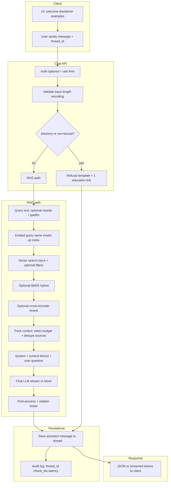

---

### 1. Session and first paint

- **Welcome**, **three example questions**, and **disclaimer** (“Facts-only. No investment advice.”) are static or config-driven.  
- **Thread list**: client holds or requests **`thread_id`** (UUID). New chat → `POST /threads` → empty history.  
- **Corpus freshness** for footer: client may call **`GET /stats` or `/corpus_version`** once per session to show “Last updated from sources” baseline (exact field is a product choice—see **Extension: mutual fund FAQ**).

---

### 2. Inbound request

- **Payload**: `thread_id`, `message` text, optional `client_request_id` for idempotency.  
- **Validation**: max message length, strip null bytes, reject empty. **Do not** log full message if policy treats it as sensitive (optional).  
- **Rate limits**: per IP / per user / per thread to cap LLM cost.  
- **Load thread history** (last *N* turns) only if you use **conversational context** in the prompt; for strict **single-turn FAQ**, history may be omitted to reduce drift—**product decision**.

---

### 3. Advisory and scope gate (before expensive RAG)

- **Goal**: satisfy “refuse investment advice” without retrieving irrelevant chunks.  
- **Implementation options**: small classifier, keyword + rules (“should I buy”, “which is better”), or a **cheap LLM** JSON decision `{"allow_rag": false, "reason": "advisory"}`.  
- **If gate closes**: return a **fixed refusal template** (polite, facts-only restatement) + **exactly one** AMFI or SEBI educational URL; **no** vector search, **no** scheme citation. Log `refusal_reason`.  
- **If gate opens**: continue to RAG.

---

### 4. Query preparation and embedding

- **Optional query rewrite**: light spelling normalization or a tiny LLM “search query” extract—must not add facts.  
- **Embed** the final query string with the **same** `embedding_model_id` and **query-side prefixes** (e.g. E5/BGE query prompts) as defined in **Embedding model selection** and **Index–query parity**.  
- **Cache**: optional exact-match cache on `(model_id, query_hash)` with short TTL—skip if threads vary wording heavily.

---

### 5. Retrieval

- **Vector search**: top-`k` (e.g. 5–20) by cosine on normalized vectors.  
- **Metadata filters** (optional): `scheme_id`, `document_type`, date range—only if the UI exposes scheme selection.  
- **Hybrid** (optional): BM25 on the same chunk text index + reciprocal rank fusion with dense scores—helps acronyms (“ELSS”, “TER”).  
- **Reranking** (optional): cross-encoder scores pairs `(query, chunk_text)` for top dense candidates; keep **latency** budget (rerank top 20 → send top 5 to LLM).  
- **Empty retrieval**: if max similarity is below a **confidence threshold** or zero hits, skip LLM factual synthesis → return **“not in knowledge base”** + suggest rephrase (no fabricated citation).

---

### 6. Context packing (prompt assembly)

- **Order**: system instructions first, then **numbered context blocks** `[1] … [2] …` each with short metadata line (`source=…`, `type=…`) and **verbatim** chunk text.  
- **Token budget**: trim lowest-ranked chunks first until under **LLM context reserve** (leave room for answer + system).  
- **Dedupe**: if multiple chunks share the same `canonical_url`, collapse redundant lines to reduce repetition.  
- **System content** (facts-only variant): max **3 sentences** in the answer; **exactly one** user-visible **source URL** chosen by a **deterministic rule** (e.g. primary citation = `canonical_url` of highest rerank score chunk actually used); forbid investment advice and performance comparisons; instruct to use only context.

---

### 7. Generation (LLM)

- **Model**: chat completion API (OpenAI-compatible or other).  
- **Parameters**: low **temperature** (e.g. 0.1–0.3) for factual tone; cap **max_tokens** for short answers.  
- **Streaming** (optional): stream tokens to UI; still run **post-process** on the full string before persisting if you enforce citation/footer in code.  
- **Tool use**: not required for baseline RAG; if added later, tools must not bypass official-source policy.

---

### 8. Post-processing and response contract

- **Citation enforcement**: if the model omitted the URL, **inject** the deterministic `canonical_url` line; if model output **two** URLs, strip to **one** per product rules.  
- **Footer**: append `Last updated from sources: <date>` using **`live_as_of`** or **`max(fetched_at)`** of retrieved chunks—document which rule you use.  
- **Sentence cap**: if more than three sentences, truncate with ellipsis or regenerate with stricter instruction (implementation choice).  
- **PII**: regex or model scan—reject or redact patterns that look like PAN/Aadhaar if ever pasted (should be rare in FAQ use).  
- **Moderation** (optional): second pass for policy violations.

---

### 9. Persistence and telemetry

- **Store** user message and assistant message in **`messages`** table (or equivalent) keyed by `thread_id`, with timestamps.  
- **Telemetry**: `latency_ms`, `retrieval_chunk_ids`, `model`, `tokens`, `refusal` flag, `empty_retrieval` flag—helps debug bad answers without storing full prompts in production if policy forbids.

---

### 10. Error handling (user-visible)

| Failure | User experience |
|---------|-----------------|
| LLM timeout / 5xx | Short apology + retry suggestion; do not invent an answer. |
| Vector DB down | “Search temporarily unavailable”; no citation. |
| Context overflow after trim | Still answer from what fits; log `trimmed_chunks`. |

---

### Five-step summary (RAG core only)

1. **Embed** the user message (same model/dimension as indexing).  
2. **Retrieve** top-k chunks (cosine on normalized vectors; optional hybrid + rerank).  
3. **Assemble prompt**: system rules + context blocks + user question.  
4. **Generate** with the chat LLM (stream optional).  
5. **Post-process**: citation, footer date, refusals, empty-context handling.

For **threads and compliance one-liners**, see **Chat API alignment (multi-thread + compliance)** below.

---

## End-to-end stages: steps, models, and minimal OpenAI usage

Aligned with **`problem_Statement.md`**: facts-only, official sources, **≤3 sentences**, **exactly one citation URL**, footer **“Last updated from sources:”** plus a resolved date (`live_as_of` or chunk `fetched_at`), refusal of advice with **one** AMFI/SEBI link, no PAN/OTP/etc.

**Cost principle:** Use **OpenAI only where language generation is required** (typically **one short chat completion per answered turn**). Run **ingestion, embeddings, retrieval, and most refusals** **without** the OpenAI API so **`OPENAI_API_KEY` usage stays minimal**.

Environment variables (example names): **`OPENAI_API_KEY`**, **`DEFAULT_MODEL`** (e.g. `gpt-4o-mini`). **Embeddings** for the vector index should use **`embedding_model_id`** pointing to a **local** model unless you explicitly choose hosted embeddings.

### Stage map (OpenAI vs local)

| Stage | What happens | Steps (ordered) | Model / tech | OpenAI calls |
|-------|----------------|-------------------|--------------|----------------|
| **S0 — Acquire** | Bring official content into the system | Read **`downloaded_sources/sources.csv`** → HTTP GET each **`url`** (or read matching file under **`downloaded_sources/`**); store raw bytes; record `fetched_at` | No ML | **0** |
| **S1 — Extract** | PDF/HTML → text | PDF: `pymupdf` / `pdfplumber` / `pypdf` (pick one stack); HTML: DOM segmentation (see **Structural segmentation: HTML**) | No ML | **0** |
| **S2 — Normalize & hash** | Clean text, `content_hash`, incremental skip | NFC whitespace, boilerplate rules; compare to ingest manifest | No ML | **0** |
| **S3 — Segment & chunk** | Structure-aware splits, token budget | Heading path, tables intact, overlap; deterministic `chunk_id` | No ML (optional **local** tokenizer only) | **0** |
| **S4 — Embed (index)** | Chunks → vectors | **Recommended:** `sentence-transformers` + **`BAAI/bge-small-en-v1.5`** or **`intfloat/multilingual-e5-small`** (if Hindi mix); batch encode, L2-normalize | **Local GPU/CPU** | **0** (avoid `text-embedding-3-*` here to save API $) |
| **S5 — Index** | Upsert vectors + metadata | Vector DB; `canonical_url`, `document_type`, `fetched_at` on every point | DB only | **0** |
| **S6 — Advisory gate** (chat) | Block advice before RAG | **Recommended:** keyword/regex + light rules (“should I buy”, “which is better”, “best fund”); fixed refusal template + static AMFI/SEBI URL | Rules / optional tiny local classifier | **0** (do **not** add a second LLM call here by default) |
| **S7 — Query embed** (chat) | User text → query vector | Same **local** bi-encoder as S4 with **query** prompts per model card | **Local** (same as S4) | **0** |
| **S8 — Retrieve** | Dense (+ optional BM25) | `top_k` small (**4–6**); optional local **cross-encoder** rerank (`bge-reranker-base`) on CPU—still **0** OpenAI | Local | **0** |
| **S9 — Pack prompt** | Build LLM input | Tight system prompt; **numbered** context blocks only; trim to fit **small** `max_context_tokens` reserved for answer | `tiktoken` count only | **0** |
| **S10 — Generate** | Answer text | **One** `chat.completions` call; **`DEFAULT_MODEL` = `gpt-4o-mini`** (strong quality/cost for short factual answers); `temperature` 0.1–0.3; **`max_tokens`** low (e.g. **200–350**)—enough for 3 sentences + citation line + footer | **OpenAI** | **1** |
| **S11 — Post-process** | Citation + footer + sentence cap | Code: enforce single URL, append `Last updated…`, truncate to 3 sentences if needed | No ML | **0** |
| **S12 — Empty retrieval** | No good chunks | Templated “not in knowledge base” response; **no** LLM call | Template | **0** |

**Typical user turn (happy path):** **1** OpenAI call (S10 only). **Refusal path (S6):** **0** OpenAI calls. **Empty retrieval:** **0** OpenAI calls.

---

### Why `gpt-4o-mini` for S10

- Meets **short**, **grounded** answers with modest cost versus larger chat models.  
- Keeps **`max_tokens`** small because the product caps answer length (**3 sentences**).  
- Do **not** route ingestion, embedding, or retrieval through OpenAI models—those explode token usage and cost.

---

### Optional OpenAI (increase usage—avoid by default)

| Pattern | OpenAI usage | Recommendation |
|---------|----------------|----------------|
| **`text-embedding-3-small`** for corpus + queries | 1× all chunk tokens on every reindex + every question | **Prefer local embeddings** (S4/S7). |
| **LLM advisory gate** | +1 call per message | **Prefer rules** (S6). |
| **LLM query rewrite / HyDE** | +1 call before retrieve | **Omit** for minimal usage. |
| **LLM reranking** | +N calls or long batch | **Prefer local cross-encoder** or skip rerank. |
| **Streaming** | Same 1 completion; slightly more overhead | OK; cost ≈ non-stream. |

---

### Prompt shape to minimize S10 tokens (problem statement aligned)

Keep **system** instructions explicit and short:

- Facts only; no advice; no performance comparisons; if context insufficient, say so.  
- Output **at most 3 sentences** of body, then **one line** with the single **Source:** URL (must match retrieved `canonical_url` rule).  
- One line **footer**: `Last updated from sources: <date>`.

Keep **context** to **4–6** chunks, each truncated to a **character or token cap** per block (e.g. 400–600 tokens total context) so input tokens to `gpt-4o-mini` stay low.

---

### Config checklist (`DEFAULT_MODEL` + keys)

1. **`OPENAI_API_KEY`**: server-side only; never ship to browser; rotate if leaked.  
2. **`DEFAULT_MODEL`**: `gpt-4o-mini` for generation; pin version in logs.  
3. **`embedding_model_id`**: local HF id, **not** an OpenAI embed model id, for minimal billing.  
4. **`.env`**: gitignored; use **`.env.example`** without secrets for teammates.

---

## Quality and reliability levers

- **Chunking**: too large → noise; too small → missing context. Tune overlap and boundaries.  
- **Hybrid retrieval**: keyword + vector helps acronyms and exact phrases.  
- **Reranking**: cross-encoder or small reranker on top-k → better precision before the LLM.  
- **Grounding**: instruct the model to refuse when context is insufficient; reduces hallucinations.  
- **Evaluation**: offline sets (question, gold passages, expected answer) + user feedback.

---

## Deployment sketch

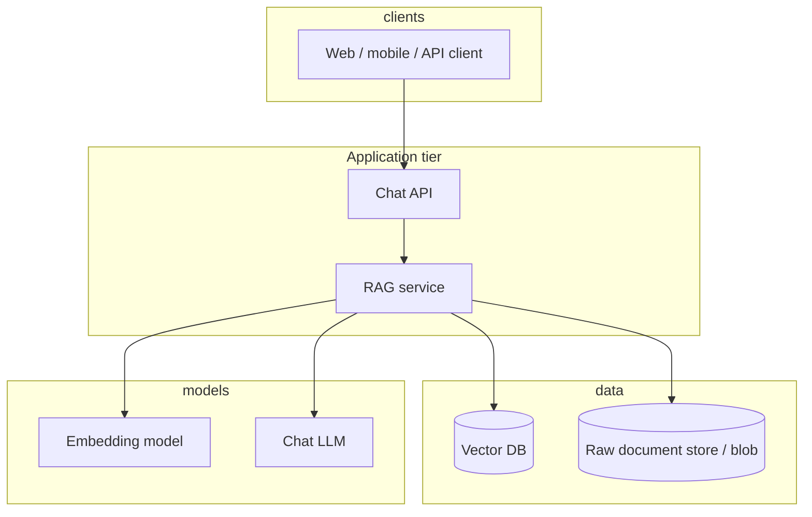

Indexing can run as **batch jobs** or **event-driven** updates when documents change; the chat path stays **low-latency read** from the vector store.

---

## Security and operations (short checklist)

- Enforce **access control** in retrieval (filter by user/tenant in metadata).  
- **Version** embeddings and collections when you change chunking or models.  
- Log **retrieved ids** (not necessarily full text) for audit and debugging.  
- Rate-limit and cap **context size** to control cost and latency.  
- **API keys** (LLM, vector DB, optional third-party data): env/secret stores only; rotate on exposure; see also **Third-party market data APIs** below.

---

## Extension: mutual fund FAQ (facts-only corpus)

For a **facts-only** assistant (see `problem_Statement.md`), the generic RAG stack stays the same, but ingestion and generation are constrained:

- **Sources**: hard **allowlist** of official URLs only (AMC, AMFI, SEBI)—no third-party aggregators.  
- **Chunk metadata**: every chunk carries **`canonical_url`**, **`document_type`** (factsheet, KIM, SID, FAQ, regulator page), **`fetched_at`**, and optional **`content_hash`** for change detection.  
- **Prompting**: system rules enforce **max 3 sentences**, **exactly one citation URL** (from retrieved metadata), **no advice**, refusal patterns for advisory questions, plus footer: `Last updated from sources: <date>`.  
- **“Last updated” date**: derive from **`max(fetched_at)`** across chunks actually used in the answer, or from a published **`corpus_version`** record updated after each successful ingest (product choice).

---

## Third-party market data APIs (e.g. Alpha Vantage) vs official corpus

Some teams also have **stock or macro data APIs** (Alpha Vantage and similar). Architecturally, treat them as a **separate boundary** from the facts-only mutual fund **document RAG**.

| Concern | Official corpus (AMC / AMFI / SEBI URLs) | Third-party JSON APIs (e.g. Alpha Vantage) |
|---------|--------------------------------------------|-----------------------------------------------|
| **Problem statement fit** | Required source for scheme facts, expense ratio, KIM/SID text, regulator guidance | **Not** a substitute for official scheme documents in the vector index used for “one citation link” to AMC/AMFI/SEBI pages |
| **Ingestion path** | Scheduled **HTTP fetch** of allowlisted PDF/HTML → chunk → embed | Optional **REST** calls; store responses only if product/legal allows; never mix into prompts as if they were the official PDF |
| **Citations** | User-visible link should remain an **official** URL from metadata | If used at all, label as non-official or keep **out** of the main citation slot (compliance decision) |
| **Performance / returns** | Brief often says: point to **official factsheet** rather than computing or comparing returns | APIs tempt time-series and “live” metrics—easy to conflict with **facts-only** and **no performance comparison** rules unless tightly scoped |

**Free tier reality (example: Alpha Vantage)**  
Per Alpha Vantage’s own support copy, the free key tier allows on the order of **25 API requests per day** for most datasets; higher volume needs **premium**. That is **too low** to drive a multi-URL daily ingest and is the wrong shape of data for bulk **scheme disclosure** text anyway. **Daily 9:15 ingestion** for the RAG corpus should remain **direct fetches of official URLs** (plus your own rate limits), not a stock API.

**Secrets**  
API keys belong in **environment variables** / CI secrets (e.g. `ALPHA_VANTAGE_API_KEY`), never committed to git. Use a **consistent variable name** in code and docs; rotate any key that was pasted into a repo or chat.

**Summary**  
Use **official URL scraping + indexing** for the compliant FAQ RAG. Use third-party market APIs only for **explicitly scoped**, non-core features (if allowed), with separate quotas, labeling, and no confusion with AMC/AMFI/SEBI citations.

**Implementation note (Alpha Vantage + HDFC sources)**  
The codebase may still **index** Alpha Vantage PDF + light market JSON **alongside** `downloaded_sources/` for operator questions or dashboards—see **Dual ingest** under **`sources.csv`** in **RAG pipeline and vector database storage**. Chat prompts should continue to **prefer official AMC context** for scheme-fact questions and treat **Market Data** as clearly **third-party**.

---

## Scheduled pipeline (e.g. daily 9:15 AM)

Run a **single daily job** (timezone explicit, e.g. `Asia/Kolkata`) that: (1) fetches allowlisted URLs, (2) normalizes text, (3) applies **incremental embed** (re-chunk + re-embed only what changed—see below), (4) updates the vector store, (5) writes a **corpus version / ingest run** record and **metrics** for dashboards.

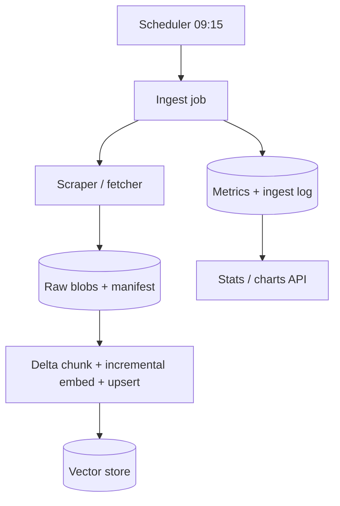

**Scheduler options** (pick one): OS `cron`, **APScheduler** inside a long-running worker, **Kubernetes CronJob**, **AWS EventBridge / GCP Cloud Scheduler**, or **GitHub Actions** scheduled workflow if hosting fits. The important part is **idempotent jobs**, **alerting on failure**, and **clock/timezone** documented for “9:15 AM”.

---

## Detailed ingestion architecture (scraping, public APIs, broker APIs)

Ingestion is everything that turns **external data** into **normalized text → segments → chunks → embeddings → vector upserts**. Split sources by **trust model** and **automation pattern** so the facts-only FAQ corpus stays separable from **markets / broker** data.

### Source taxonomy

| Source type | How data arrives | Typical use in this project | Corpus fit (`problem_Statement.md`) |
|-------------|-------------------|-----------------------------|-------------------------------------|
| **A. Static HTTP (scrape)** | `GET` allowlisted **AMC / AMFI / SEBI** HTML or PDF URLs | Primary **RAG corpus** | **Yes** — official public documents |
| **B. Conditional HTTP** | Same as A + `If-None-Match` / `If-Modified-Since` | **Incremental** daily updates | **Yes** |
| **C. Official open data APIs** | JSON/CSV from a **government or regulator** documented endpoint (if explicitly allowlisted) | Structured facts mirrored into text for chunking | **Yes**, only if your spec treats that endpoint as a **first-class official source** and citations are defined |
| **D. Broker / trading APIs** | OAuth2 client credentials, then **access** / **refresh tokens**; REST for quotes, margins, user-scoped data | **Not** AMC KIM/SID text; optional **live stats**, dashboards, or internal tools | **No** for “single official scheme citation” FAQ unless product and compliance **explicitly** expand scope |
| **E. Third-party market data APIs** (e.g. Alpha Vantage) | API key + REST | Optional non-corpus analytics; strict quotas | **No** as primary RAG ground truth |
| **F. Local curated files** | PDFs/HTML under **`downloaded_sources/`** plus **`downloaded_sources/sources.csv`** (columns `url`, `document_type`, `scheme`, `description`) | Snapshot or **CSV-driven** ingest: each row’s **`url`** is the **canonical** download; local files are optional mirrors | **Yes**, when every row points to an **official** AMC / AMFI / SEBI (or explicitly allowlisted) URL—review any non-disclosure URLs (e.g. blogs) for corpus fit |

Treat **A+B** (and **F** when manifest-backed) as the **default corpus** for the mutual fund FAQ assistant. Treat **D+E** as **separate connectors** writing to **other** tables or caches (or driving UI widgets), **not** mixed into the same retrieval index as factsheet/KIM/SID chunks unless you consciously redesign citations.

---

### Connector pattern (recommended code shape)

Implement each upstream as a **`SourceConnector`** with a small common surface:

- **`list_work_units()`** — e.g. one row from **`downloaded_sources/sources.csv`**, one `canonical_url`, one **local file path** under `downloaded_sources/`, or one API entity mapped to a logical document.  
- **`fetch(work_unit)`** → **`RawDocument`**: bytes or text, `mime_type`, **`canonical_url`** (from HTTP response or manifest), optional **`local_path`** for audit, HTTP headers when applicable (synthetic `etag` from file hash for local files).  
- **`normalize(raw)`** → clean UTF-8 string for **structural segmentation** (HTML/PDF paths elsewhere in this doc).  

The **daily job** orchestrates: load allowlist → build work units → **bounded concurrent** `fetch` → normalize → hash → incremental chunk/embed → vector upsert → manifest + **`ingest_runs`**.

This keeps **scraping** and **REST ingestion** behind the same interface so you can add an official JSON feed later without rewriting the chunking stage.

---

### Scraping (HTTP) ingestion — details

- **Discovery**: for this repo, load the allowlist from **`downloaded_sources/sources.csv`** (one **`url`** per row) or an equivalent curated list (15–25 official URLs per `problem_Statement.md`). Optional **sitemap** only if those pages are explicitly allowlisted.  
- **Execution**: session with timeouts, retries, per-host concurrency caps (see **Batching and concurrency (ingest job)**).  
- **Politeness**: honor **`robots.txt`** per host; cache `robots` for the run.  
- **Artifacts**: persist **raw bytes** (or lossless copy) to object storage for audit; persist **normalized text** for reproducible `content_hash`.  
- **PDF vs HTML**: route by `Content-Type` and magic bytes; PDF through layout/text extractors; HTML through **DOM structural segmentation**.

---

### Reference implementation: `scraper.py` (`HDFCScraper`)

The repo includes a concrete scraper at **`scraper.py`** (class **`HDFCScraper`**) that implements part of **S0–S2** (acquire + light normalize). It **does not** embed, write to a **vector DB**, or maintain the **ingest manifest**—those are downstream stages you wire after this module.

#### Inputs

| Input | Current behavior in code | Alignment target |
|-------|-------------------------|-------------------|
| **URL list CSV** | Default path **`milestone-1-db/source-urls.csv.csv`** (docstring is stale vs layout); expects columns **`Source URL`**, **`Title`**, **`Short Description`**, **`Full Text`**, **`Category/Type`** | Point **`csv_path=`** at **`downloaded_sources/sources.csv`** and **map columns**: `Source URL` ← `url`, carry `document_type`, `scheme`, `description` into the dict the rest of the pipeline expects—or add a thin **CSV adapter** so one code path reads the new schema. |
| **Local PDFs** | Scans **`milestone-1-db/`** (same folder as the legacy CSV) via **`_get_pdf_files()`** | For **`downloaded_sources/`**, either change **`db_folder`** / constructor logic to **`downloaded_sources`** or treat PDFs as **optional mirrors** of rows in **`sources.csv`** (recommended: one row per official `url`, fetch over HTTP; local PDF optional cache). |

#### Fetch and extract (HTML)

1. **`scrape_with_requests`**: `GET` with a desktop **User-Agent**, **10s** timeout, **`BeautifulSoup`** + `html.parser`.  
2. **Strips** `script`, `style`, `nav`, `footer`, `header` (coarse main-content approximation—not full heading-table segmentation from **Structural segmentation: HTML**).  
3. **`get_text(separator=' ', strip=True)`** → single flattened string (no heading path preservation).  
4. If text is **missing or shorter than 100 characters**, **`scrape_with_playwright`**: headless **Chromium**, `wait_until="networkidle"`, **30s** navigation timeout, **2s** sleep, then same soup strip + `get_text`.  
5. **`scrape_url`**: tries **requests first**, then Playwright—good for **JS-heavy** AMC pages.

#### Fetch and extract (PDF)

- Uses **`pypdf.PdfReader`** with **`PyPDF2`** fallback.  
- Concatenates **per-page** `extract_text()` with **`\n\n`**.  
- **Category / source** inferred from **filename** substrings (`KIM`, `SID`, `FACTSHEET`, `SEBI`, `AMFI`, etc.).  
- **`scheme_name`** from filename heuristics (`_extract_scheme_name_from_filename`).

#### Output contract (per document)

Each successful scrape/parse returns a **dict** suitable as input to **chunking** (after you add `canonical_url` normalization):

| Key | Meaning | Caveat |
|-----|---------|--------|
| **`url`** | Page URL for HTML pulls; for folder PDFs set to **`file://…`** | **`file://` is not a valid user-facing citation** for `problem_Statement.md`—replace with the **official `https://…`** from **`sources.csv`** for the same document when writing **vector metadata**. |
| **`content`** | Plain text body | No `content_hash` yet—compute in the **ingest job** before incremental logic. |
| **`source`** | Coarse enum: `hdfc_amc`, `sebi`, `amfi` (from URL or filename) | Fine for filters; keep **`document_type`** from CSV when available. |
| **`title`**, **`description`**, **`category`**, **`scheme_name`** | Metadata / display | Map **`scheme`** from CSV when ingesting from **`sources.csv`**. |

#### Orchestration and rate limiting

- **`scrape_all_schemes`**: loops all CSV URLs, then **`parse_all_pdfs`**; concatenates both lists.  
- **`time.sleep(2)`** between **each** URL request—polite but **sequential**; architecture **batching and concurrency** suggests bounded parallelism + per-host limits for larger lists (optional evolution).  
- **No `robots.txt` fetch** in code today—add before production hardening.

#### Pipeline position vs vector DB

```text
scraper.py  →  [normalize / segment / chunk / embed]  →  vector DB upsert  →  RAG query path
   ↑                        ↑
 S0–S2 (partial)      not implemented in this file
```

Treat **`HDFCScraper`** as a **producer**; the **vector store** section above defines what the **consumer** must persist after chunking and embedding.

---

### Local folder ingestion (`downloaded_sources/`)

The folder holds **PDFs** (and optional mirrors of HTML) that correspond to rows in **`downloaded_sources/sources.csv`**. The **CSV is the source of truth** for **`url`**, **`document_type`**, and **`scheme`**; local files are optional **byte-identical** copies for offline work or faster IO.

#### Filename patterns (when CSV is primary)

If a PDF exists without a row, **skip** or add a CSV row. When both exist, match by **normalized `url`** (same file downloaded from that URL). Typical **HDFC MF** filenames still hint at doc type:

| Pattern in filename | Typical `document_type` | Chunking note |
|---------------------|-------------------------|---------------|
| **KIM** | `KIM` | Heading-path segmentation. |
| **SID** | `SID` | Same; track effective date in ops logs. |
| **Factsheet** | `Factsheet` | Large, table-heavy. |
| **Notice** | `Notice` | Short deltas. |
| **Investor Charter** | `Charter` | FAQ-style. |
| **Riskometer** / **Annual Disclosure** | `Disclosure` | Tables + narrative. |
| **Presentation** | `Presentation` | Policy: facts-only vs marketing—decide before indexing. |
| **Other Funds** / RSF | `Report` / supplement | Use CSV `scheme` + `document_type`. |

#### Optional JSON manifest

For path-only workflows (no URL in CSV), **`sources_manifest.json`** can list `{ "path", "canonical_url", … }` per file—see **`sources_manifest.example.json`**. Prefer **`sources.csv`** when every document already has an official **`url`**.

#### Connector: `CsvSourceConnector` + optional `LocalFileConnector`

- **`CsvSourceConnector.list_work_units()`**: read **`downloaded_sources/sources.csv`** → one work unit per row (`url` + metadata).  
- **`fetch`**: HTTP GET **`url`** (normalized) **or** read local PDF whose hash matches last successful fetch.  
- **`normalize`**: same PDF/HTML pipelines as elsewhere; attach **`document_type`** and **`scheme`** from the CSV onto each chunk’s metadata for **vector DB filters** and citations.

#### Operations

- **Git / CI**: PDFs can be **large** (multi‑MB factsheets). Prefer **Git LFS**, **artifact storage**, or **build-time download** from a private bucket so the git repo stays small.  
- **Overlap with HTTP cron**: choose one **primary** source per logical document (either always refresh from URL, or treat folder as **golden snapshot** and disable URL fetch for those IDs) to avoid **duplicate chunks** for the same scheme section.  
- **Security**: only place files you **trust** from official sites; virus-scan if the folder is writable by many people.

---

### Public / official API ingestion (REST instead of or beside HTML)

When an **official** body exposes **JSON or CSV** you decide to allow:

1. Call the API per published spec (official API key if issued).  
2. Map each response to one or more **synthetic documents** (pretty-printed JSON + a short human summary, or row-flattened text for tables).  
3. Set metadata **`canonical_url`** to a **documented citation target** (spec PDF URL, portal page, or stable `source_id` + internal citation rule)—get **compliance** sign-off on what the user sees as “source”.  
4. Run the same **hash → incremental embed** path as for scraped text.

Do not label **broker** or generic **vendor** market JSON as equivalent to **scheme legal disclosure** text from AMC PDFs.

---

### Broker APIs (optional) — scope and security

**Broker** REST APIs provide **trading and market** data, not replacement text for **SID/KIM**. Architecturally:

- **Separate module** from **corpus** ingest; optional **parallel** step in the same cron **only** if you need quotes/stats in a **different** store than the RAG vector index.  
- **Authentication**: OAuth2 using **client id**, **client secret**, **redirect URI**; obtain **short-lived access token** and **refresh token**; refresh before expiry in a small token helper or secure worker.  
- **Do not** commit or log **account password**, **PIN**, or **TOTP/2FA secrets** for automated ingestion. Prefer **one-time user login** to seed tokens, then store tokens in a **secret manager**. Cron on **GitHub Actions** should not embed long-lived passwords in env vars that appear in logs.  
- **Env naming**: vendor-specific (`*_APP_ID`, `*_ACCESS_TOKEN`, etc.) — keep **`.env` gitignored**; rotate any credential exposed in a repo, backup, or ticket.

Use broker data for **dashboards / alerts / non-FAQ features** unless compliance approves broader use.

---

### Unified daily job (conceptual)

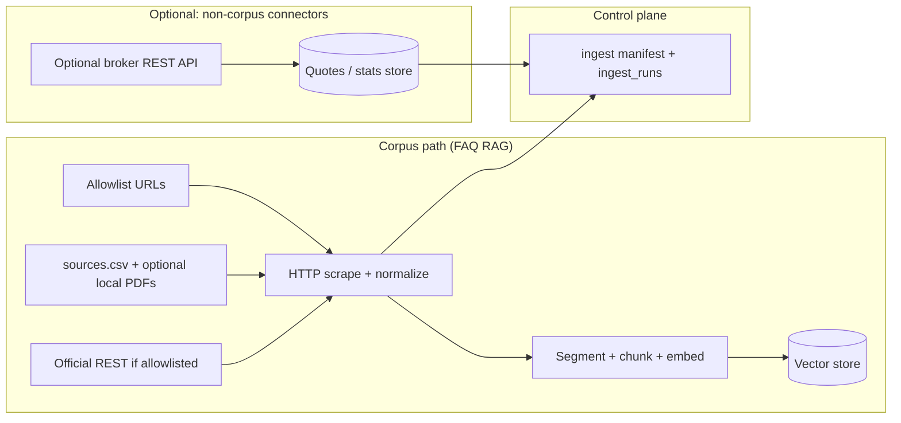

The **9:15** scheduler can run **corpus** steps every day and **broker** steps on a different cadence or failure policy—same orchestrator, **separate** persistence and **separate** product surface.

---

## Scraper → RAG: how updates are “pushed”

1. **Fetch**: HTTP GET per allowlisted URL; respect **robots.txt**, **rate limits**, and timeouts. Support **HTML** and **PDF** (text extract only).  
2. **Normalize**: strip boilerplate where safe; store **raw** copy for audit and **clean text** for chunking.  
3. **Change detection**: compare **`content_hash`** (or ETag/Last-Modified if reliable) to skip unchanged pages; see **Incremental embed (daily cron)** for the full delta + embed loop.  
4. **Index**: chunk clean text; attach metadata (`canonical_url`, `scheme_id`, `fetched_at`, …); embed **only** for sources whose hash changed unless a forced reindex applies.  
5. **Vector store update strategies**:  
   - **Replace-by-source**: delete existing vectors for `source_id` / `canonical_url`, then upsert new chunks (simple, good for small corpus).  
   - **Versioned collection**: write to `collection_YYYYMMDD`; flip **alias** the chat API reads from after success; keep previous for rollback.  
6. **Atomic “go live”**: only bump **`corpus_version`** / **`live_as_of`** after the vector update and sanity checks succeed, so the UI footer and RAG never advertise fresher data than what is actually searchable.

Chat traffic **does not** call the scraper; it only reads the **vector store** + **corpus metadata** updated by the job.

---

## Incremental embed (daily cron)

Full re-embed of the entire corpus every day wastes **CPU/GPU**, **API budget** (if embeddings are hosted), and **job time** (risky on CI minute limits). **Incremental embed** means: for each allowlisted source, detect **whether normalized content changed**; if not, **skip embedding** for that source; if yes, **re-chunk only that document**, **embed only new or changed chunks**, and **delete** vectors for chunks that disappeared.

### Preconditions (store a small **ingest manifest**)

Persist per `canonical_url` (or `source_id`), e.g. in SQLite/Postgres or a JSON manifest in object storage:

| Field | Use |
|-------|-----|
| `content_hash` | Hash of **normalized** text (or stable raw bytes policy)—compare after each fetch |
| `etag` / `last_modified` | Optional HTTP hints to **skip download** when unchanged (not always present or trustworthy) |
| `chunking_version` | Bump → **forced re-chunk + re-embed** for that URL or whole corpus |
| `embedding_model_id` | Change → **full re-embed** of all chunks (vectors incompatible across models) |
| `last_success_ingest_at` | Auditing and stats |

Without a manifest, the job cannot know what to skip; keep it **small** and **authoritative**.

### Daily job flow (incremental)

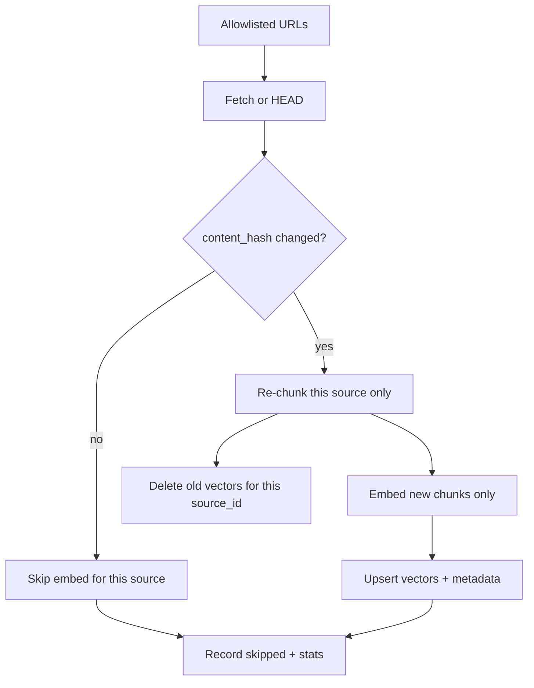

1. **Fetch**: optionally use **conditional requests** (`If-None-Match` / `If-Modified-Since`) when you stored ETag/Last-Modified; on `304`, skip body processing entirely.  
2. **Normalize + hash**: compute `content_hash_new`. Compare to manifest’s `content_hash`.  
3. **Unchanged** (`content_hash_new == content_hash`): update optional “verified at” timestamp only; **no** delete, **no** embed calls for that URL.  
4. **Changed**:  
   - **Delete-by-source**: remove all vector ids belonging to this `canonical_url` (or `source_id`) from the vector store so stale chunks never remain.  
   - **Re-chunk** the new normalized text with the **current** `chunking_version`.  
   - **Embed** only the resulting chunk list using **batched** encoder or API calls (see **Batching and concurrency (ingest job)**).  
   - **Upsert** with stable ids (recommended: deterministic `chunk_id` including `canonical_url`, `chunking_version`, and `chunk_index`, or content-hash per chunk if you prefer dedup).  
5. **Manifest update**: set `content_hash`, bump `fetched_at` / ingest metadata after successful vector write.

### Chunk-level refinement (optional second pass)

If chunking is **deterministic** in index, you can compute a **per-chunk text hash** after splitting. When a document changes but only slightly, **theory** says many chunk texts repeat; in practice boundaries shift so **most chunks after a small edit get new text**. For mutual fund PDFs, **document-level skip** (hash whole normalized doc) is usually enough; chunk-level diff adds complexity for modest savings unless pages are huge.

### When incremental is **not** enough (force full reindex)

| Trigger | Action |
|---------|--------|
| **`embedding_model_id` changes** | Re-embed **all** chunks (dimensions and geometry change). |
| **`chunking_version` or strategy changes** | Re-chunk **all** sources; safest is **full replace** per source in one job window. |
| **Metadata schema migration** | Plan a one-off **re-upsert** (may or may not require re-embed if only metadata changes). |
| **Corruption / unknown drift** | Nightly or weekly **full rebuild** to a new collection + alias flip (optional safety net). |

### Metrics to log each run (for charts and debugging)

- `sources_total`, `sources_skipped_unchanged`, `sources_reindexed`  
- `chunks_embedded`, `chunks_deleted` (implicit in replace-by-source)  
- `embed_seconds`, `fetch_errors`  
- Optional: **estimated cost saved** vs full corpus embed (baseline once, then compare)

### Alignment with “atomic go live”

Incremental updates still finish with a single **`live_as_of` / `corpus_version`** bump **after** the batch of deletes+upserts for **that cron run** succeeds, so the UI never shows a newer date while some vectors are mid-update.

---

## Batching and concurrency (ingest job)

Daily (or frequent) ingest benefits from **parallel I/O** and **batched embedding**, but uncontrolled concurrency causes **429s**, **OOMs**, **duplicate cron overlap**, and **partial vector states**. The rules below keep throughput high and behavior predictable.

### Goals

| Goal | Mechanism |
|------|-----------|
| **Fast wall-clock** | Concurrent fetches (bounded) + batched embed calls + batched vector upserts |
| **Politeness / compliance** | Per-host concurrency caps, delays, `robots.txt` |
| **Correctness** | One active **writer** per collection per cron window; **no overlapping** scheduled runs unless explicitly designed (blue/green) |
| **Predictable cost** | Respect hosted embed **RPM** / **tokens per minute** with backoff |

---

### Fetch layer: bounded concurrency

- Use a **worker pool** or **async semaphore** (e.g. 4–8 simultaneous downloads) instead of unbounded `asyncio.gather` over dozens of URLs.  
- **Per-host limit**: if many URLs share one AMC domain, cap concurrent connections to that host (e.g. 2–4) to reduce ban risk; spread work with a small inter-request delay if needed.  
- **Reuse** `HTTP/2` or keep-alive **sessions**; set connect/read **timeouts**; retry with jitter on transient `5xx` / network errors.  
- **Conditional GET** (`If-None-Match`) still benefits from concurrency; `304` responses are cheap.

---

### Embedding layer: batching and backpressure

**Local sentence-transformers (or similar)**  

- Accumulate chunks into **micro-batches** sized by **VRAM/RAM** (typical explore range **16–128** sequences per forward pass; smaller on CPU-only runners).  
- **Pad or pack** per model requirements; truncate to **max tokens** before batching.  
- Optional **pipeline**: thread A fetches + chunks, queue → thread/GPU B embeds in batches (queue max size caps memory).

**Hosted embedding APIs**  

- Send **max allowed texts per request** (often tens, not thousands); split the day’s **changed** chunks into multiple API calls.  
- Enforce a **token budget** per minute from vendor docs; on **429**, exponential backoff and **reduce** concurrent API calls (global limiter, not per-batch only).  
- **Idempotency**: same `chunk_id` upserted twice is OK; avoid double-charging logic by batching deduped ids.

---

### Vector store: batched upserts

- Prefer **bulk upsert** (hundreds to a few thousand points per call, vendor-dependent) over one HTTP call per vector.  
- Order of operations for a **changed** source: **delete-by-source** (or tombstone) **then** **bulk upsert** new chunks for that source—keep these **sequential per `canonical_url`** to avoid windows where deletes applied but upserts not yet visible (or use a **staging** collection + alias flip).  
- **Cross-source parallelism**: safe to upsert **different** `canonical_url` blobs in parallel **only if** the vector DB and your id scheme guarantee no id collisions and the DB handles concurrent writes; when in doubt, **serialize writes** or use **db transaction** per batch.

---

### Cron overlap: concurrency control (critical)

- Use a **single-flight** lock: e.g. GitHub Actions `concurrency: group: ingest-${{ github.ref }}` with **`cancel-in-progress: false`** so a second scheduled trigger **waits** or **skips** instead of two jobs mutating the same index.  
- Alternatively: **lease row** in Postgres (`ingest_lock` until job completes) so only one runner proceeds.  
- Overlapping runs without coordination can interleave **delete** and **upsert** from two jobs and briefly serve **empty or mixed** retrieval results.

---

### Recommended staging model (high parallelism, safe cutover)

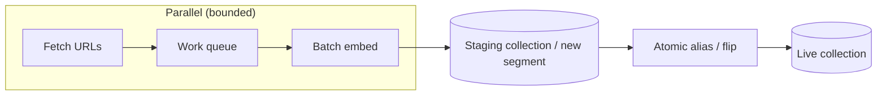

For larger corpora: workers write to **staging**; after **validation**, swap the **alias** the chat API reads (**blue/green**). That allows aggressive parallelism during build without readers seeing half-updated live data.

---

### Chat (query) path: light concurrency

- **Query embeddings** are usually **one vector per turn**; modest parallel chat requests are fine.  
- **Retrieval + LLM** per request: cap concurrent LLM calls to protect **budget** and **rate limits**; retrieval is comparatively cheap.  
- Do **not** run full-corpus embed inside the request path.

---

### Metrics to add for tuning batching

- `fetch_concurrency_peak`, `embed_batch_size_p50`, `embed_api_429_count`  
- `vector_upsert_batch_count`, `ingest_wall_seconds`  
- Compare runs after lowering fetch concurrency (fewer errors?) vs raising embed batch size (faster until OOM)

---

## Stats, “current value,” and live charts

Treat **observability** as a small **metrics + events** layer updated by the ingest job and optionally by the chat API.

| Signal | Use |
|--------|-----|
| **Last successful ingest** (`live_as_of`) | Footer text, “current freshness” widget |
| **Run status** (success / partial / failed) | Banner or ops dashboard |
| **Counts** (URLs OK/failed, chunks written, duration) | Bar/line charts over time |
| **Scrape errors** (per URL) | Drill-down table |

**Implementation patterns**:

- **Lightweight**: append-only **`ingest_runs`** table (SQLite/Postgres) + JSON summary per run; **admin API** `GET /stats/ingest` returns latest row; UI **polls every N seconds** or uses **SSE** for “live” feel.  
- **Heavier / ops**: expose **Prometheus** metrics (`ingest_last_success_timestamp`, `ingest_urls_failed_total`, …) and build charts in **Grafana**; same numbers can be mirrored to the product UI via a thin **stats** endpoint.

**“Current value”** in the product usually means: **last successful pipeline completion time** + optional **corpus version** string, not live market NAV (out of scope unless you ingest official NAV pages as separate, clearly labeled facts).

---

## Deployment: Streamlit vs Vercel + GitHub Actions (daily 9:15)

Use **GitHub Actions for the schedule and heavy work** (fetch, extract, chunk, embed, write stats). Use **Streamlit or Vercel for the user-facing app** that **reads** the updated data. The UI should not own the cron; that avoids Streamlit/Vercel sleep, timeouts, and cold-start limits for long scrapes.

### Responsibility split

| Piece | Where it runs | Why |
|--------|----------------|-----|
| **Cron at “9:15 AM”** | **GitHub Actions** `schedule` workflow | Reliable clock; easy logs; no extra server |
| **Fetch + parse + chunk + embed** | Same workflow (or job container) | Python + secrets in repo settings |
| **Vector DB + ingest stats** | **External managed service** (Supabase/pgvector, Pinecone, Chroma Cloud, S3 + API, etc.) | Both Streamlit and Vercel can read it; Actions writes to it |
| **Chat + charts UI** | **Streamlit** *or* **Vercel** | Product choice (see below) |

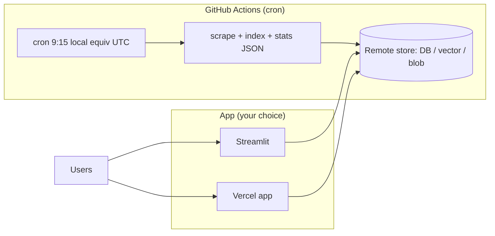

### Timezone: GitHub Actions uses **UTC**

The `schedule` trigger is **UTC-only**. For **9:15 AM in `Asia/Kolkata` (IST, UTC+5:30)**, 09:15 IST equals **03:45 UTC** the same calendar day, so cron is **`45 3 * * *`** (minute 45, hour 3). For another region, convert **local 9:15 → UTC** and set `cron` accordingly. Document the intended timezone in the workflow comment so operators are not surprised.

### Option A — **Streamlit** (Python-first)

- **Deploy** on [Streamlit Community Cloud](https://streamlit.io/cloud), Railway, Render, Hugging Face Spaces, etc.  
- **App**: chat UI + `st.metric` / charts reading **latest ingest row** and optional RAG query path (retrieve + call LLM with `streamlit` streaming).  
- **Actions**: daily job pushes new embeddings + **`ingest_runs`** (or a small `stats/latest.json` in object storage—avoid committing large binaries to git).  
- **Fit**: fastest path if the whole stack is Python and you want one language for scrape + UI.

**Caveat**: Streamlit Cloud is not ideal for **embedding millions** of tokens on every request; keep heavy indexing in Actions only.

### Option B — **Vercel** (web-first)

- **Deploy** Next.js (or similar) on Vercel: static UI + **Route Handlers** / serverless functions for chat.  
- **Actions**: same as above—**writes** vectors and stats to Supabase, PlanetScale, Upstash, S3, etc. Vercel functions **read** at request time.  
- **Fit**: strong UX, edge, SEO; good if the team prefers TypeScript for UI. Long-running scrape **does not** belong in a serverless function (10s–300s limits); keep scrape in Actions.

**Caveat**: Pure **Streamlit on Vercel** is not a first-class pattern; choose **Next.js on Vercel** + Python elsewhere for indexing, or use **Streamlit** on a Python host instead of Vercel for that part.

### Secrets and safety

- Store **API keys** (LLM, vector DB, optional embed API) in **GitHub Actions secrets**, not in the repo.  
- Same secrets (or read-only keys) on Streamlit Cloud / Vercel env vars for the chat path.  
- The scheduled workflow should **fail loudly** (issue, Slack, or failed job email) when scrape or index fails so “stats” are not silently stale.  
- Set workflow **`concurrency`** so two 9:15 runs never overlap the same index—see **Batching and concurrency (ingest job)**.

### What “runs at 9:15” in practice

1. **Actions** starts at the UTC time equivalent to your local 9:15.  
2. Job fetches allowlisted URLs, updates **chunks + vectors**, appends **`ingest_runs`** (counts, errors, `live_as_of`).  
3. **Streamlit or Vercel** does nothing on a timer; when users open the app or refresh charts, they see **yesterday’s or today’s** run depending on load time. Optional: **poll** `GET /stats` every N seconds on an admin page for “near live” charts after the morning run completes.

---

## Chat API alignment (multi-thread + compliance)

Step-by-step request handling (advisory gate → retrieve → pack → LLM → post-process → save) is in **Chatbot runtime flow (detailed)** above.

- **Threads**: store **`thread_id`** server-side; each message scoped to a thread; RAG retrieval is usually **global** to the corpus unless you add **metadata filters** (e.g. scheme) from the client.  
- **Citation**: prefer the **single** `canonical_url` from the top retrieved chunk used in the answer (or deterministic rule documented in product spec).  
- **Refusals**: classifier or LLM-with-schema for advisory detection → short refusal + **one** educational AMFI/SEBI link (no second “advice” path).

---

## Summary diagram (scheduled RAG + stats)

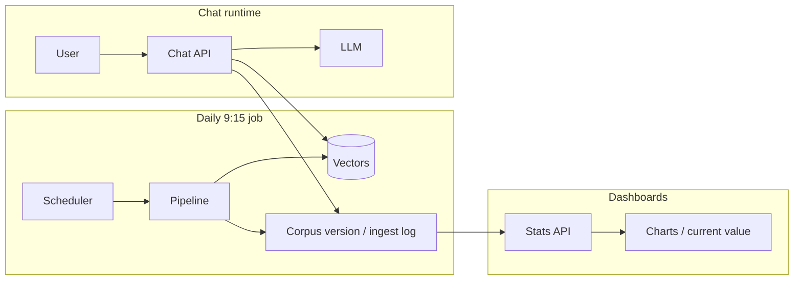

---

## Implementation roadmap (phased delivery)

For a **step-by-step build order** aligned with `problem_Statement.md` (corpus → ingest/vector → RAG/threads → UI & cron), see the **`phases/`** folder:

- [`phases/README.md`](phases/README.md) — index of four phases  
- [`phases/phase-1-corpus-and-compliance.md`](phases/phase-1-corpus-and-compliance.md)  
- [`phases/phase-2-ingest-and-vector-index.md`](phases/phase-2-ingest-and-vector-index.md)  
- [`phases/phase-3-rag-assistant-and-threads.md`](phases/phase-3-rag-assistant-and-threads.md)  
- [`phases/phase-4-ui-scheduler-and-release.md`](phases/phase-4-ui-scheduler-and-release.md)

---

This document describes the architecture only; it is not tied to a specific framework or repository layout. Where `problem_Statement.md` applies, the **official URL corpus** is the source of truth for retrieved facts and citations; third-party market APIs are optional and peripheral unless the product explicitly extends scope.
